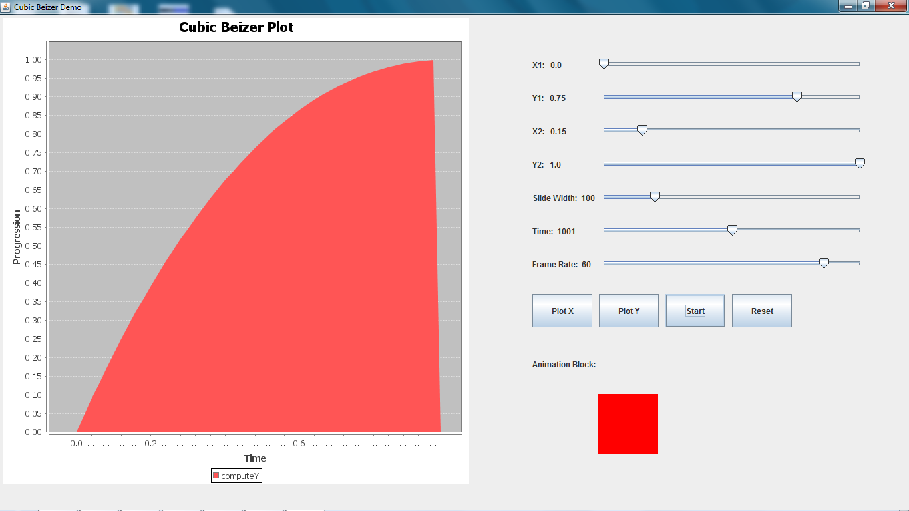

Cubic Biezer Easing
===============

###What is a Cubic Beizer?
--------------------------

*Cubic Beizers* are a family of curves which are used widely in the field of Computer Graphics. With their help we can simulate various easing animations.
They can be represented uniquely by a set of 4 points, as shown in the animation below:

Courtesy: *[Wikipedia](http://en.wikipedia.org	)*

Wikipedia: *[Cubic Beizer](http://en.wikipedia.org/wiki/B%C3%A9zier_curve#Cubic_B.C3.A9zier_curves	)*

###What Does This Application Do?
---------------------------------

The __Tests_AdvancedBeizerPlot__ class provides the complete GUI to alter control points for the Cubic Beizer. It also gives control over animation timing and frames per second.

###Screenshot:
--------------

###How Do I Run It?
-------------------

* __Import__ the project into Eclipse, or,
* Compile and Run Tests_AdvancedBeizerPlot. *Make sure the jar files in the lib folder are on the classpath.*

###Attribution
--------------
* Many thanks to people behind [JFreeChart](http://www.jfree.org/jfreechart/	)

###Author
---------

Written by Divyanshu Verma.
dev.verma1010@gmail.com